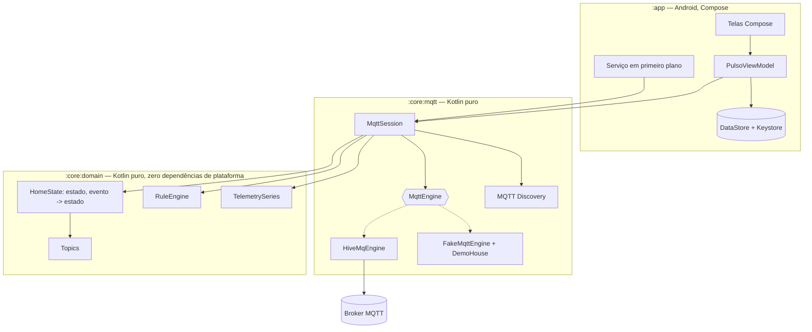

# Pulso

**Central MQTT de bolso.** Um app Android que descobre sozinho os dispositivos
da sua casa, mostra o estado deles em tempo real, executa automações locais e
traz um inspetor de tráfego MQTT completo — tudo sem nuvem, sem conta e sem
assinatura.

Este repositório começou em **novembro de 2017**, como projeto de MBA: um app
Java que acendia uma lâmpada por MQTT. Este é o mesmo projeto, oito anos e meia
década de plataforma depois. A ideia original continua ali — falar MQTT com um
dispositivo — mas tudo em volta mudou, e o que era um controle remoto de um
aparelho virou uma ferramenta de trabalho.

> A análise completa do que era bom, do que era ruim e do que foi feito está em
> **[docs/ANALISE.md](docs/ANALISE.md)**.

---

## O que ele faz

| | |
|---|---|
| 🔍 **Descoberta automática** | Assina `homeassistant/+/+/config` e monta o dashboard sozinho. Qualquer coisa que fale MQTT Discovery — Tasmota, ESPHome, Zigbee2MQTT, Shelly, Z-Wave JS UI — aparece na tela sem uma linha de código nova. |
| 🏠 **Dashboard por cômodo** | Lâmpadas, tomadas, sensores e sensores binários, agrupados, com estado ao vivo e brilho ajustável. |
| 📈 **Telemetria** | Série temporal por sensor com sparkline desenhada em Canvas, mín./média/máx. na tela de detalhe. |
| ⚡ **Automações locais** | `se temperatura > 28 → liga o ventilador`, com histerese e cooldown, rodando **no aparelho**. Sem servidor, sem conta, funciona com a internet caída. |
| 🔬 **Inspetor MQTT** | Um MQTT Explorer embutido: trilha do tráfego cru, assinatura ad-hoc de filtros e publicação manual de payloads. |
| 🎭 **Modo demonstração** | Abre com uma casa inteira funcionando — sem broker, sem hardware, sem rede. É o estado padrão da primeira execução. |
| 🔐 **TLS por padrão** | Tráfego em texto puro é bloqueado fora da rede local; senha guardada com chave do Android Keystore. |

## Rodando em cinco minutos

**Só o app, sem nada mais:** instale e abra. O modo demonstração já está ligado
e a casa simulada aparece na hora.

**Com um broker de verdade:**

```bash
cd tools/simulator
docker compose up          # Mosquitto + firmwares fictícios que se anunciam
```

Depois, nos ajustes do app: desligue o modo demonstração e aponte para
`10.0.2.2:1883` (emulador) ou o IP da sua máquina (aparelho físico).

**Com o seu hardware:** se ele já publica MQTT Discovery, não há configuração
nenhuma — só apontar para o broker. Se ele fala um dialeto próprio (como o
ESP8266 do projeto de 2017, que respondia a `"1"` e `"0"` no tópico `led`), o
`PayloadVocabulary` cobre isso sem gambiarra.

## Compilando

```bash
./gradlew :core:domain:test :core:mqtt:test   # núcleo: segundos, sem SDK Android
./gradlew :app:assembleDebug                  # APK
```

Requisitos: JDK 17+, Android SDK 36. O núcleo compila com Gradle e JDK apenas.

## Vendo o app rodar sem ter um Android

O workflow **Screenshots** sobe um emulador na nuvem, instala o app, navega
pelas telas e publica as imagens e um vídeo como artefato do build. Abre em
qualquer navegador — inclusive num iPhone.

Aba **Actions → Screenshots → Run workflow**, ou espere o push. O artefato
`pulso-em-execucao` traz:

```
01-dashboard.png              a casa simulada já povoada
02-detalhe-dispositivo.png    controle, telemetria e os tópicos reais
03-automacoes.png             regras e histórico de disparos
04-inspetor.png               tráfego MQTT cru
05-ajustes.png                broker, TLS, descoberta
06-dashboard-com-historico.png  depois de a sparkline ter o que desenhar
pulso.mp4                     o percurso inteiro em vídeo
logcat-completo.txt           e o log, para quando algo der errado
```

O script que dirige o emulador está em [`scripts/screenshots.sh`](scripts/screenshots.sh)
e falha o build se aparecer uma exceção fatal no logcat — então ele também
serve de teste de fumaça da inicialização.

Para **interagir** de fato sem aparelho, use o APK publicado pelo CI num
emulador de navegador (Appetize.io tem plano gratuito; BrowserStack App Live
tem período de teste).

## Arquitetura



A regra que organiza tudo: **nada que decide comportamento conhece Android.**
O estado da casa é uma função pura `(estado, evento) → estado`, o motor de
regras é determinístico com relógio injetado, e o transporte é uma interface
com duas implementações. Consequência prática: 84 testes cobrem reconexão,
descoberta, reconciliação otimista, histerese e telemetria — e rodam em
segundos, sem emulador.

Detalhes em **[docs/ARQUITETURA.md](docs/ARQUITETURA.md)**.

## Estrutura

```
core/domain/     Modelo, estado da casa, automações, telemetria, tópicos  (Kotlin puro)
core/mqtt/       Transporte, descoberta, sessão, broker falso             (Kotlin puro)
app/             Compose, ViewModel, DataStore, Keystore, serviço          (Android)
tools/simulator/ Mosquitto + firmwares fictícios em Python                 (Docker)
docs/            Análise, arquitetura, segurança, o app de 2017
```

## Onde isto é útil

Além da casa: qualquer lugar em que dispositivos publicam estado e recebem
comando por MQTT — automação predial, monitoramento de estufa, telemetria de
equipamento em campo, bancada de laboratório, sala de aula de IoT, e a
depuração de qualquer projeto MQTT (o inspetor sozinho já justifica ter o app
instalado). O catálogo de usos está em [docs/ANALISE.md](docs/ANALISE.md#possibilidades-de-uso).

## Segurança

Modelo de ameaças, o que está protegido e o que explicitamente não está:
**[docs/SEGURANCA.md](docs/SEGURANCA.md)**.

## O projeto de 2017

O original está preservado no histórico do Git (`git log`) e as imagens da
apresentação estão em [`docs/legado/`](docs/legado/) — inclusive a lâmpada
acesa e apagada que eram a interface inteira do app.

Não há vergonha nenhuma naquele código: ele fazia o que precisava fazer, na
plataforma que existia, e a ideia estava certa. O que mudou foi o mundo em
volta — e é exatamente disso que trata a [análise](docs/ANALISE.md).

---

Feito por Raul Sousa. Licença MIT.
