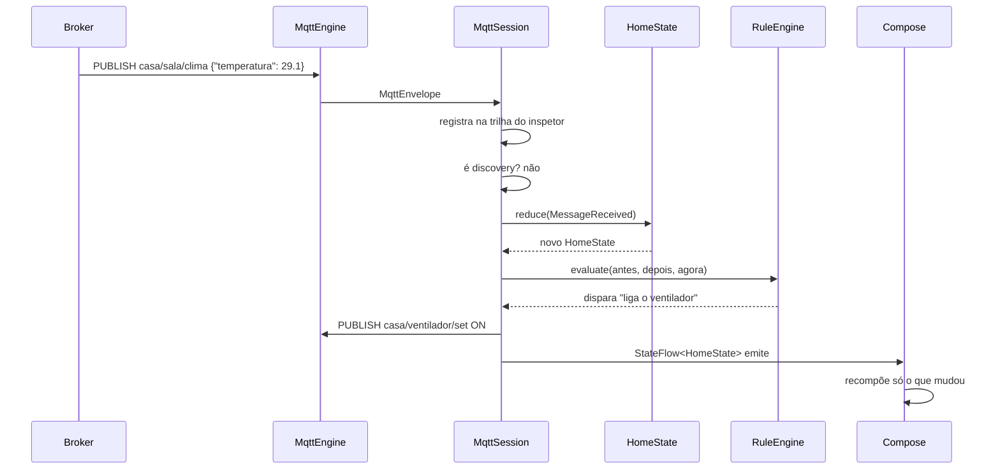

# Arquitetura

Uma regra organiza o projeto inteiro:

> **Nada que decide comportamento conhece Android.**

Tudo o que pode dar errado de forma interessante — reconexão, descoberta,
reconciliação de estado, histerese de automação, janela de telemetria — vive em
módulos Kotlin puros. O módulo Android é fino de propósito: ele desenha e
encaminha eventos.

## Módulos

```
:core:domain    Kotlin puro. Sem Android, sem MQTT, sem I/O.
:core:mqtt      Kotlin puro. Transporte, descoberta, sessão. Depende de :core:domain.
:app            Android. Compose, ViewModel, DataStore, Keystore, serviço.
```

A dependência aponta sempre para dentro: `:app → :core:mqtt → :core:domain`.
Nunca ao contrário.

## O núcleo é uma função

O estado da casa é imutável e evolui por uma função pura:

```kotlin
fun HomeState.reduce(event: HomeEvent, nowMillis: Long): HomeState
```

Cinco eventos cobrem tudo: dispositivo anunciado, dispositivo removido, mensagem
recebida, comando otimista, passagem de tempo. Não há campo mutável, não há
callback, não há `Context`. Testar "o que acontece quando chega `offline` no
tópico de disponibilidade enquanto há um comando pendente" é uma linha de teste.

Duas propriedades valem destacar:

- **Identidade preservada quando nada muda.** `reduce` devolve `this` se o
  evento não alterou nada. Isso evita recomposição desnecessária no Compose e é
  verificado em teste (`assertTrue(before === after)`).
- **Tempo é parâmetro, não ambiente.** Nenhuma função lê o relógio do sistema
  direto; quem precisa recebe `nowMillis` ou um [`Clock`](../core/domain/src/main/kotlin/com/raulsousa/pulso/domain/Clock.kt)
  injetado. É o que torna cooldown e timeout determinísticos.

## A fronteira do transporte

```kotlin
interface MqttEngine {
    val state: StateFlow<ConnectionState>
    val incoming: Flow<MqttEnvelope>
    suspend fun connect(profile: BrokerProfile)
    suspend fun publish(intent: PublishIntent): Result<Unit>
    // …
}
```

Três implementações:

| | |
|---|---|
| `HiveMqEngine` | MQTT 5 de verdade, TLS, last will, reconexão automática. |
| `FakeMqttEngine` | Broker em memória. Wildcards, entrega seletiva, retidos. Usado nos testes **e** no modo demonstração. |
| `SwitchableMqttEngine` | Delega a um dos dois e troca em tempo de execução, sem recriar a sessão. |

Esta interface é a lição central da análise: quando o Paho foi arquivado, o
projeto de 2017 teve que ser reescrito. Se houver um `HiveMqEngine` para
aposentar em 2033, será um arquivo novo.

## O fluxo de uma mensagem



## Comando otimista com reconciliação

O app de 2017 trocava a imagem quando o usuário tocava — e mentia se o
dispositivo não respondesse. Aqui o ciclo é:

1. Usuário toca → `HomeEvent.OptimisticCommand` → estado muda **na hora**
   (interface responsiva) e o comando entra em `pending`.
2. Publica no tópico de comando.
3. O dispositivo confirma pelo tópico de estado → `pending` é limpo.
4. Se em 5 s não confirmou → `HomeEvent.Tick` marca o dispositivo como
   indisponível.

A interface é rápida **e** honesta. As duas coisas.

## Descoberta

`MqttSession` assina `<prefixo>/+/+/config` e `<prefixo>/+/+/+/config`. Cada
anúncio vira um `Device`; payload vazio significa remoção.

Detalhe que só aparece na prática: a remoção chega **sem** `unique_id` — o
payload é vazio. Por isso a sessão mantém um índice `tópico de discovery → id do
dispositivo`. Sem ele, um dispositivo retirado do ar ficaria para sempre no
dashboard. Foi um teste que pegou isso, não uma revisão.

As assinaturas são calculadas por delta: reassinar tudo a cada anúncio geraria
uma tempestade de `SUBSCRIBE` numa casa com trinta dispositivos.

## Concorrência

- Mensagens chegam na thread de rede do Netty (HiveMQ).
- A redução de estado acontece num bloco `synchronized` curto — é barata e
  precisa ser atômica em relação a comandos vindos da UI.
- `MutableSharedFlow` com `DROP_OLDEST` na entrada: telemetria em rajada não
  pode segurar o socket. Perder a amostra mais velha é preferível.
- A UI observa `StateFlow` com `collectAsStateWithLifecycle` — nada toca a View
  fora da main thread, o que era um bug latente no código de 2017.

## Ciclo de vida no Android

| | |
|---|---|
| `PulsoApplication` | Cria o `AppContainer` e conecta na primeira execução. |
| `AppContainer` | Injeção à mão: repositórios, motores, sessão, timer de expiração. |
| `MainActivity` | Compose, permissão de notificação, liga/desliga o serviço. |
| `MqttForegroundService` | Mantém a sessão viva com o app fechado. Só sobe se o usuário pedir. |

O serviço é iniciado pela `Activity`, não pelo `Application`: desde o Android 12
iniciar um serviço em primeiro plano com o app em background é bloqueado.

## Por que não Hilt, Room, ou uma biblioteca de gráficos

- **Hilt**: o grafo de dependências cabe numa tela. Trocar depois é mecânico.
- **Room**: nada precisa de consulta relacional hoje. Entra quando houver
  retenção de telemetria.
- **Biblioteca de gráficos**: a sparkline são 40 linhas de `Canvas`. Uma
  biblioteca entra quando houver eixo, zoom e legenda.

Cada dependência não adicionada é uma que não precisa ser mantida, auditada, nem
migrada quando for arquivada — que é, afinal, o assunto deste repositório.
